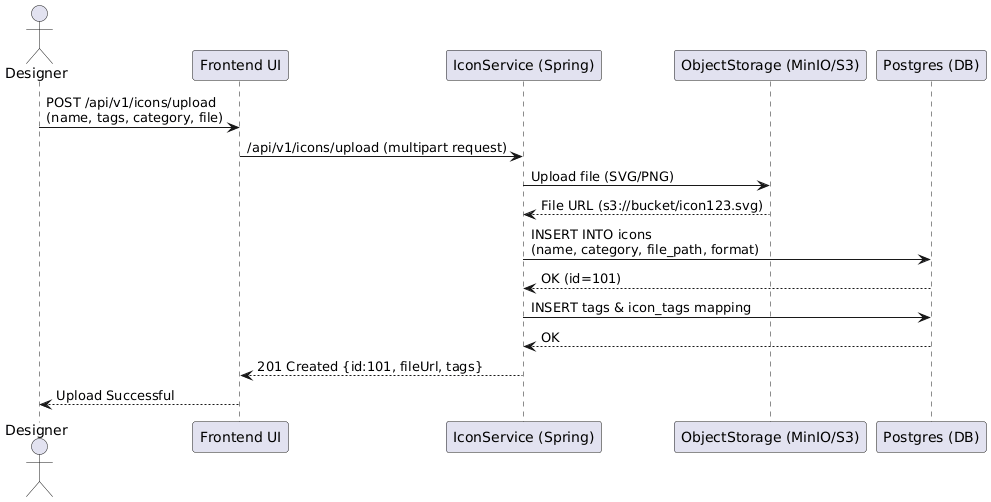
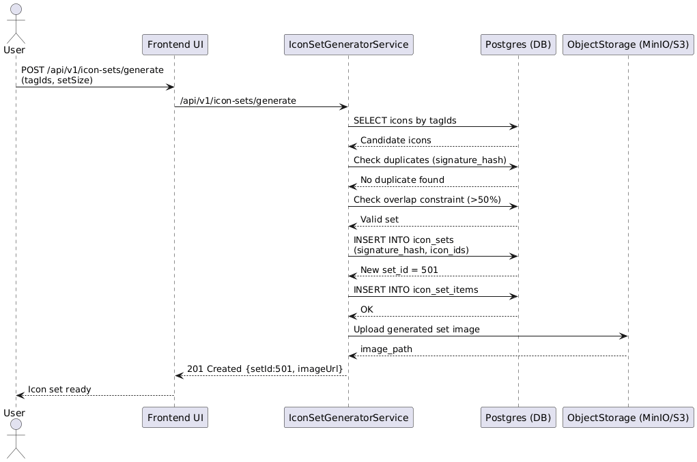
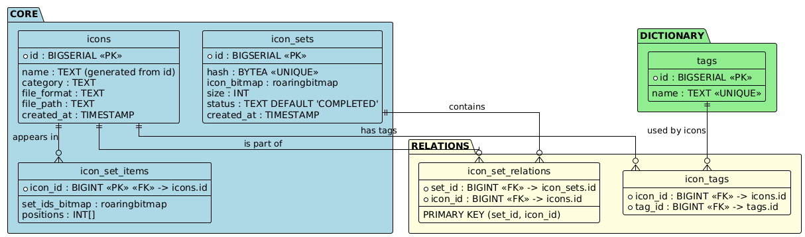
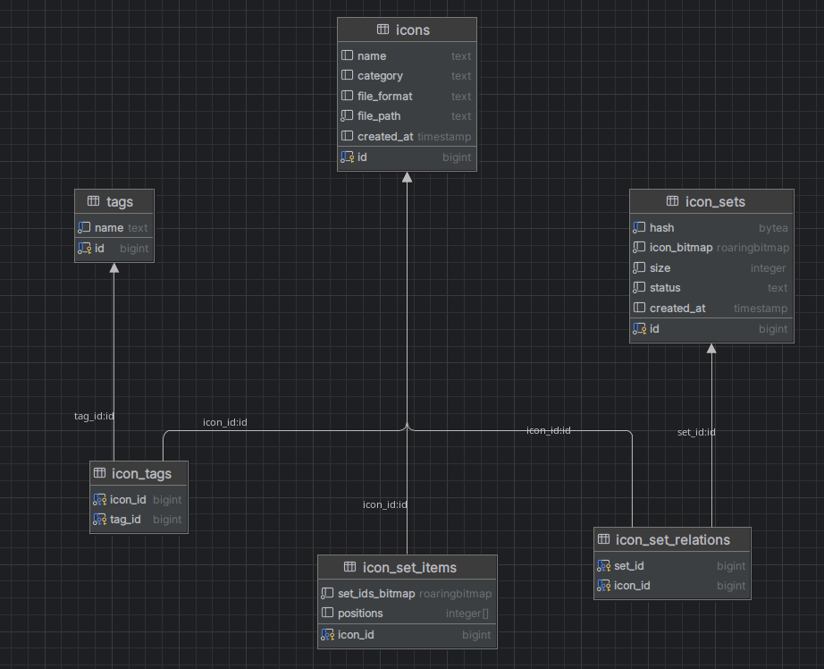

# Introduction

**Icon Set Generator Demo** is a Spring Boot-based backend service designed to generate optimized icon sets based on user-provided tags. It efficiently handles icon metadata using PostgreSQL with advanced bitmap indexing (`roaringbitmap`) and integrates with **MinIO** for object storage.

### Key Features
- Dynamic icon set generation based on tag combinations  
- High-performance bitmap operations using RoaringBitmap  
- File upload and storage integration via MinIO  

### Component Interaction
1. The client sends an `IconSetRequest` (with tag IDs, set size, threshold).
2. `IconSetGeneratorService` calls a custom repository method (`generateSetFromTags`) to generate a bitmap-based set.
3. The database executes the function and returns a `setId`.
4. The response is wrapped in an `IconSetResponse` and sent back to the client.
5. If files are uploaded, `MinioService` stores them in a specified bucket.


# API Endpoints

##  1. Icon Upload API

### **POST /api/icons/upload**
Upload an icon with its metadata to corresponding database (postgres + minIO)


**Description:**  
Uploads a single icon along with its metadata (tags, category, etc.).

**Metadata JSON Structure**
```json
{   
 "category": "vehicles",  
 "tags": [{"name": "favorite"}, {"name": "cars"}] 
} 


```

**Response (success) Example:**
```json
{
    "id": 93,
    "name": "vehicles/1759822332856.png",
    "tags": [
        "favorite",
        "cars"
    ],
    "category": "vehicles"
}
```


##  2. Icon Set Generator API

### **POST /api/icon-sets/generate**

Generate a new icon set from provided tags.

**Description:**  
Takes a list of tag IDs, a desired set size, and a threshold.  
Internally calls the PostgreSQL function `generateSetFromTags`.

**Request Body Example:**
```json
{
  "tagIds": [1, 2, 3, 4],
  "setSize": 10,
  "threshold": 0.3
}

```

**Response (success) Example:**
```json
{
  "setId": 101,
  "status": "SUCCESS"
}
```
**Response (failure) Example:**
```json
{
  "setId": null,
  "status": "FAILED_OR_DUPLICATE_OR_OVERLAP"
}
```

# Diagrams

1. Sequence flow: Upload File Scenario 

  

2. Sequence flow: Generate Icon Set

  

3. Tables 

  

3. DB Schema 

  


